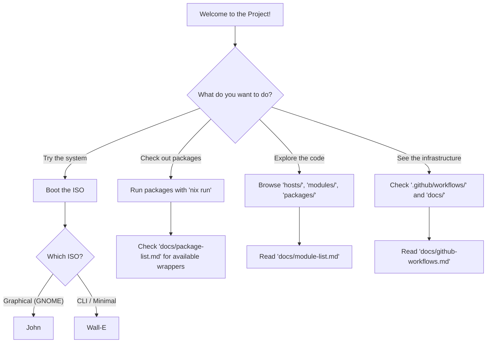

# Quickstart - Flavortown Showcase

Welcome to the Flavortown showcase! This guide will help you quickly explore the various aspects of this NixOS configuration.

## Table of Contents

- [Introduction](#introduction)
- [Decision Tree](#decision-tree)
- [Setup Instructions](#setup-instructions)
    - [ISO](#iso)
    - [Packages](#packages)
    - [Code](#code)
- [Detailed Sections](#detailed-sections)

## Introduction

### Introduction to Flavortown

Flavortown is an online hackathon for teenagers created by people from [hackclub](https://hackclub.com/).
I'm submitting this project and I need to show what I made.
If you aren't a judge or somebody voting on my submission, you can ignore this piece of docs, it's not related to actual functionality of the project.

### Why dedicated showcase docs?

Most of the projects on Flavortown are websites or programs you can directly interact with.
My project isn't like that. Yes, you can go and boot the ISO, check the system, but you will interact with programs others made and experiences others manufactured.
I didn't make them, I wrote some code and created infrastructure for the project.
I would feel bad if you credit me for something I didn't create.

If the handholding in this document feels too forced for you, you're free to read normal documentation, code or even do what dissuade you from and judge me based on the feel of the system.

## Decision Tree

Use this diagram to decide how you want to explore the project:



## Setup Instructions

### ISO

The easiest way to see the system in action is to boot one of the provided ISOs. You can download them from the [Releases](https://github.com/First-Non-Interesting-Username/NixOS-config/releases) page.

- **[John (Graphical)](../hosts.md#john)**: Includes a full GNOME desktop environment. Recommended for most users. Requires Vulkan support.
- **[Wall-E (CLI)](../hosts.md#wall-e)**: Minimal, terminal-only version for low-resource systems.
- **Credentials**: 
    - Username: `nixos`
    - Password: `nixos` (also for `sudo`)

For more details, see the [ISO guide](../iso.md).

### Packages

You don't need to install the whole system to try my custom package wrappers. If you have Nix installed, you can run them directly:

```bash
# Run btop with my custom theme/config
nix run github:First-Non-Interesting-Username/NixOS-config#btop

# Run fastfetch with my custom configuration
nix run github:First-Non-Interesting-Username/NixOS-config#fastfetch

# Try the foot terminal wrapper
nix run github:First-Non-Interesting-Username/NixOS-config#foot
```

Check the [Package List](../package-list.md) for more information.

### Code

If you want to dive into the Nix code itself:

- **[hosts/](../../hosts/)**: Specific machine configurations.
- **[modules/](../../modules/)**: The building blocks of the system.
- **[packages/](../../packages/)**: Custom package wrappers.

**Note:** I've kept comments to a minimum because the project is extensively documented in these Markdown files. Refer to [module-list.md](../module-list.md) for a comprehensive overview of what each module does.

## Detailed Sections

Once you've tried the system, you can read more about the technical details:

- [**Technical Showcase**](./showcase.md): Deep dive into the Nix code and my favorite snippets.
- [**Conclusion**](./conclusion.md): Final thoughts and appreciation.
