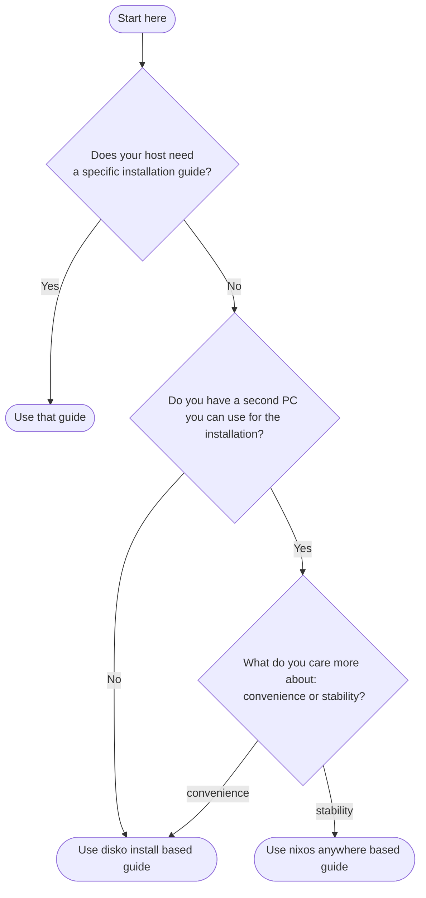

# Install Guides

## Table of Contents

- [Decision tree](#decision-tree)
- [Overview](#overview)
- [Guides](#guides)
  - [General Purpose Machines](#general-purpose-machines)
  - [Host-Specific Guides](#host-specific-guides)
- [Prerequisites](#prerequisites)

## Overview

Install guides cover the process of installing NixOS using this configuration.

Guides are organized by machine type or installation method.

## Decision tree

First decide on a [host](./hosts.md) and then choose a installation guide.

## Guides

### General Purpose Guides

- [NixOS-Anywhere based install guide](./install-guides/install-guide-nixos-anywhere.md) — Covers installation using nixos-anywhere for machines on your local network.
- [Disko-install based install guide](./install-guides/install-guide-disko-install.md) - Covers intallation using disko install for single machine setups.

### Host-Specific Guides

None of the current hosts require dedicated installation guides.

## Prerequisites

All guides assume you have:

- Familiarity with basic CLI usage.
